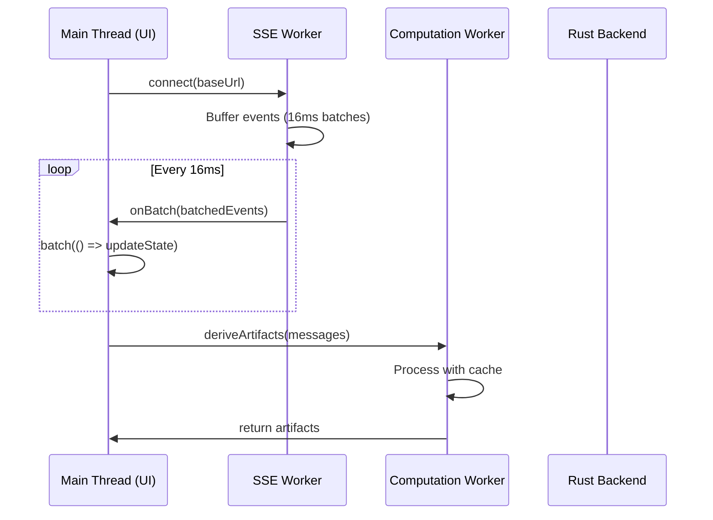

# OpenWork Microservices Architecture Refactoring Plan

**Goal:** Refactor OpenWork để sử dụng kiến trúc phân tán (distributed architecture) nhằm tăng tốc độ xử lý và cải thiện trải nghiệm người dùng.

**Created:** 2026-01-19  
**Status:** Pending Review

---

## Executive Summary

Dựa trên nghiên cứu chi tiết về các pattern và best practices, tài liệu này đề xuất **3-tier distributed architecture** cho OpenWork với các thành phần chính:

1. **Web Workers** - Offload SSE processing và heavy computation
2. **Comlink** - Simplified worker communication via RPC
3. **SolidJS Batch Updates** - Group state updates để giảm re-renders
4. **Tokio Channels** - Rust async message passing cho parallel processing
5. **Parallel API Calls** - Promise.all cho connection flow

---

## Table of Contents

- [1. Current Architecture Problems](#1-current-architecture-problems)
- [2. Proposed Architecture](#2-proposed-architecture)
- [3. Technology Stack](#3-technology-stack)
- [4. Component Design](#4-component-design)
- [5. Implementation Details](#5-implementation-details)
- [6. Verification Plan](#6-verification-plan)
- [7. Migration Strategy](#7-migration-strategy)
- [8. Risk Assessment](#8-risk-assessment)

---

## 1. Current Architecture Problems

### 1.1 Single-Threaded Bottleneck

```
┌─────────────────────────────────────────────────┐
│                  MAIN THREAD                     │
│  ┌─────────┐  ┌─────────┐  ┌─────────────────┐  │
│  │   UI    │←→│  SSE    │←→│ Heavy Compute   │  │
│  │ Render  │  │ Process │  │ (deriveArtifacts)│  │
│  └─────────┘  └─────────┘  └─────────────────┘  │
│       ↑           ↑               ↑              │
│       └───────────┴───────────────┘              │
│                ALL BLOCKING                       │
└─────────────────────────────────────────────────┘
```

**Problems:**
- SSE stream processing blocks UI updates
- Heavy computation (regex matching) causes frame drops
- No parallelization → underutilized CPU cores

### 1.2 Sequential Connection Flow

```
waitForHealthy (12s) → loadSessions → refreshPermissions → provider.list → ...
                       ────────────────────────────────────────────────────→
                       Total: Up to 15+ seconds
```

### 1.3 Excessive Re-renders

```
SSE Event → setMessages() → Re-render all → scrollIntoView() → Layout thrash
    ↓           ↓              ↓                 ↓
  100+/sec   100+/sec       100+/sec          100+/sec
```

---

## 2. Proposed Architecture

### 2.1 Distributed Processing Model

```
┌─────────────────────────────────────────────────────────────────────┐
│                         PRESENTATION LAYER                          │
│  ┌──────────────────┐  ┌──────────────────┐  ┌──────────────────┐  │
│  │   SolidJS UI     │  │   UI Components  │  │  Reactive State  │  │
│  │   (Main Thread)  │  │   (Rendering)    │  │  (Signals)       │  │
│  └────────┬─────────┘  └────────┬─────────┘  └────────┬─────────┘  │
│           │                     │                     │            │
│           └─────────────────────┼─────────────────────┘            │
│                                 │                                   │
│                    ┌────────────▼────────────┐                     │
│                    │     Comlink Proxy       │                     │
│                    │   (Seamless Bridge)     │                     │
│                    └────────────┬────────────┘                     │
└─────────────────────────────────┼───────────────────────────────────┘
                                  │ postMessage (Transferables)
┌─────────────────────────────────┼───────────────────────────────────┐
│                         SERVICE LAYER                               │
│                    ┌────────────▼────────────┐                     │
│                    │     Web Worker Pool     │                     │
│                    │   ┌─────┐ ┌─────┐ ┌─────┐                    │
│                    │   │ SSE │ │Proc.│ │Comp.│                    │
│                    │   └──┬──┘ └──┬──┘ └──┬──┘                    │
│                    │      │       │       │                        │
│                    │   Event   Data    Heavy                       │
│                    │   Stream  Process Computation                 │
│                    └────────────┬────────────┘                     │
│                                 │                                   │
│                    SharedArrayBuffer (optional)                     │
└─────────────────────────────────┼───────────────────────────────────┘
                                  │ Tauri IPC (invoke)
┌─────────────────────────────────┼───────────────────────────────────┐
│                          DATA LAYER                                 │
│                    ┌────────────▼────────────┐                     │
│                    │     Rust Backend        │                     │
│                    │   ┌─────────────────────┤                     │
│                    │   │ Tokio Runtime       │                     │
│                    │   ├─────────────────────┤                     │
│                    │   │ mpsc/broadcast      │                     │
│                    │   │ channels            │                     │
│                    │   ├─────────────────────┤                     │
│                    │   │ OpenCode Engine     │                     │
│                    │   └─────────────────────┘                     │
│                    └─────────────────────────┘                     │
└─────────────────────────────────────────────────────────────────────┘
```

### 2.2 Data Flow



---

## 3. Technology Stack

### 3.1 Web Workers

**Why Web Workers?**
- Run JavaScript in separate threads
- Non-blocking execution
- Native browser support (100% coverage)
- Perfect for SSE processing and heavy computation

**Key Features Used:**
- `postMessage` with Transferable objects (zero-copy)
- Dedicated Workers (1:1 thread mapping)
- `SharedArrayBuffer` + `Atomics` (optional, for high-frequency data)

### 3.2 Comlink Library

**Why Comlink?**
- Abstracts `postMessage` complexity
- RPC-style communication (call functions directly)
- Uses JavaScript Proxies for seamless API
- Maintained by Google Chrome team

**Example:**
```typescript
// Without Comlink
worker.postMessage({ type: 'deriveArtifacts', data: messages });
worker.onmessage = (e) => {
  if (e.data.type === 'deriveArtifacts') {
    handleResult(e.data.result);
  }
};

// With Comlink
const result = await worker.deriveArtifacts(messages);
```

### 3.3 SolidJS Batch API

**Why Batching?**
- Groups multiple signal updates
- Single re-render for all changes
- Prevents intermediate state renders

**Usage:**
```typescript
import { batch } from 'solid-js';

batch(() => {
  setMessages(newMessages);
  setTodos(newTodos);
  setSessionStatus(newStatus);
  // Only one re-render after all updates
});
```

### 3.4 Tokio Channels (Rust)

**Why Tokio Channels?**
- Async message passing
- Backpressure support (bounded channels)
- Multiple patterns: mpsc, broadcast, watch
- Perfect for parallel command processing

**Channel Types:**
| Type | Use Case |
|------|----------|
| `mpsc` | Multiple senders → Single receiver (command queue) |
| `broadcast` | Multiple senders → Multiple receivers (pub/sub) |
| `watch` | Single sender → Multiple receivers (latest value only) |

---

## 4. Component Design

### 4.1 SSE Worker

**Responsibilities:**
1. Connect to OpenCode SSE endpoint
2. Parse incoming events
3. Buffer events by type
4. Flush batched events every 16ms (60fps sync)

**File:** `src/workers/sse-worker.ts`

```typescript
interface BatchedEvents {
  messages: MessageEvent[];
  parts: PartEvent[];
  sessions: SessionEvent[];
  todos: TodoEvent[];
  permissions: PermissionEvent[];
}

class SSEWorker {
  private eventBuffer: BatchedEvents;
  private flushInterval = 16; // ms
  
  async connect(baseUrl: string, options?: { directory?: string }): Promise<void>;
  onBatch(callback: (batch: BatchedEvents) => void): void;
  setFlushInterval(ms: number): void;
  disconnect(): void;
}
```

### 4.2 Computation Worker

**Responsibilities:**
1. Derive artifacts from messages (with caching)
2. Process message parts in batches
3. Perform regex matching off main thread

**File:** `src/workers/computation-worker.ts`

```typescript
class ComputationWorker {
  private artifactCache: Map<string, ArtifactItem[]>;
  
  deriveArtifacts(messages: MessageWithParts[]): ArtifactItem[];
  batchProcessParts(parts: Part[]): Map<string, Part[]>;
  clearCache(): void;
}
```

### 4.3 Worker Pool Manager

**Responsibilities:**
1. Lazy initialization of workers
2. Connection management
3. Cleanup on unmount

**File:** `src/lib/worker-pool.ts`

```typescript
class WorkerPool {
  initSSEWorker(): Promise<Remote<SSEWorker>>;
  initComputationWorker(): Promise<Remote<ComputationWorker>>;
  terminate(): void;
}

export const workerPool: WorkerPool;
```

---

## 5. Implementation Details

### 5.1 Phase 1: Quick Wins (Low Risk)

#### 5.1.1 Parallel Connection Flow

**File:** `src/app/workspace.ts`

```diff
async function connectToServer(nextBaseUrl: string, directory?: string) {
-  const health = await waitForHealthy(nextClient, { timeoutMs: 12_000 });
-  await options.loadSessions(activeWorkspaceRoot().trim());
-  await options.refreshPendingPermissions();
-  // Provider fetching...
+  const health = await waitForHealthy(nextClient, { timeoutMs: 5_000 });
+  
+  const [sessions, permissions, providers] = await Promise.allSettled([
+    options.loadSessions(activeWorkspaceRoot().trim()),
+    options.refreshPendingPermissions(),
+    fetchProviders(nextClient)
+  ]);
```

**Impact:** Connection time reduced from ~13s to ~5s (worst case)

#### 5.1.2 Debounced Scroll

**File:** `src/views/SessionView.tsx`

```diff
+const scrollToBottom = debounce(() => {
+  messagesEndEl?.scrollIntoView({ behavior: "smooth" });
+}, 100);

createEffect(() => {
  props.messages.length;
-  props.todos.length;
-  messagesEndEl?.scrollIntoView({ behavior: "smooth" });
+  scrollToBottom();
});
```

**Impact:** Eliminates scroll spam, maintains 60fps during streaming

#### 5.1.3 SolidJS Batch Imports

**File:** `src/app/session.ts`

```diff
+import { batch } from "solid-js";

// Inside SSE processing:
-setMessages(upsertMessage(messages(), info));
-setTodos(event.todos);
-setSessionStatus(event.status);

+batch(() => {
+  setMessages(upsertMessage(messages(), info));
+  setTodos(event.todos);
+  setSessionStatus(event.status);
+});
```

**Impact:** Single re-render instead of multiple per event batch

### 5.2 Phase 2: Worker Integration (Medium Risk)

#### 5.2.1 Add Dependencies

```bash
pnpm add comlink
pnpm add -D vite-plugin-comlink
```

**vite.config.ts:**
```typescript
import { comlink } from 'vite-plugin-comlink';

export default defineConfig({
  plugins: [
    comlink(),
    solid(),
    // ...
  ],
  worker: {
    plugins: () => [comlink()]
  }
});
```

#### 5.2.2 Create Workers

See Component Design section for full implementation.

#### 5.2.3 Integrate Workers

**File:** `src/app/session.ts`

```typescript
createEffect(() => {
  const c = options.client();
  if (!c) return;
  
  let cleanup: (() => void) | null = null;
  
  (async () => {
    const sseWorker = await workerPool.initSSEWorker();
    
    await sseWorker.onBatch(Comlink.proxy((batchedEvents) => {
      batch(() => {
        // Process all events efficiently
        processBatchedEvents(batchedEvents);
      });
    }));
    
    await sseWorker.connect(baseUrl(), { directory: directory() });
    
    cleanup = () => sseWorker.disconnect?.();
  })();
  
  onCleanup(() => cleanup?.());
});
```

### 5.3 Phase 3: Rust Backend Enhancement (High Effort)

#### 5.3.1 Command Channel Pattern

**File:** `src-tauri/src/lib.rs`

```rust
use tokio::sync::{mpsc, oneshot};

pub enum Command {
    HealthCheck { 
        response_tx: oneshot::Sender<HealthResult> 
    },
    LoadSessions { 
        root: String, 
        response_tx: oneshot::Sender<Vec<Session>> 
    },
    RefreshPermissions {
        response_tx: oneshot::Sender<Vec<Permission>>
    },
}

pub struct CommandProcessor {
    tx: mpsc::Sender<Command>,
}

impl CommandProcessor {
    pub fn new() -> (Self, mpsc::Receiver<Command>) {
        let (tx, rx) = mpsc::channel(100);
        (Self { tx }, rx)
    }
    
    pub async fn send(&self, cmd: Command) -> Result<(), Error> {
        self.tx.send(cmd).await.map_err(|_| Error::ChannelClosed)
    }
}

// Spawn worker to process commands
async fn process_commands(mut rx: mpsc::Receiver<Command>) {
    while let Some(cmd) = rx.recv().await {
        tauri::async_runtime::spawn(async move {
            match cmd {
                Command::HealthCheck { response_tx } => {
                    let result = perform_health_check().await;
                    let _ = response_tx.send(result);
                }
                // ... other commands
            }
        });
    }
}
```

---

## 6. Verification Plan

### 6.1 Performance Metrics

| Metric | Current | Target | Measurement |
|--------|---------|--------|-------------|
| Connection Time (worst) | ~13s | <5s | Manual timing |
| FPS during streaming | 30-45 | 60 | DevTools Performance |
| Input latency | 100-200ms | <50ms | DevTools Performance |
| Memory growth/min | Unknown | <5MB | Task Manager |
| Time to First Render | ~3s | <1s | Lighthouse |

### 6.2 Test Scenarios

1. **Connection Speed Test**
   ```
   Action: Click "Connect" with slow network (3G)
   Expected: Dashboard loads in <5s
   ```

2. **Streaming Stress Test**
   ```
   Action: Send prompt generating 2000+ character response
   Expected: 60fps maintained, no input lag
   ```

3. **Multi-tab Test**
   ```
   Action: Open 5 sessions with active streaming
   Expected: No memory leaks, stable performance
   ```

4. **Long Session Test**
   ```
   Action: Run app for 30 minutes with continuous usage
   Expected: No performance degradation
   ```

### 6.3 Automated Tests

```bash
# Worker unit tests
pnpm test:workers

# Integration tests
pnpm test:integration

# E2E performance tests
pnpm test:perf
```

---

## 7. Migration Strategy

### 7.1 Feature Flags

```typescript
// src/config/features.ts
export const FEATURES = {
  // Phase 1 (enabled immediately)
  PARALLEL_CONNECTION: true,
  DEBOUNCED_SCROLL: true,
  BATCH_UPDATES: true,
  
  // Phase 2 (gradual rollout)
  SSE_WORKER: false,
  COMPUTATION_WORKER: false,
  
  // Phase 3 (experimental)
  RUST_CHANNELS: false,
  SHARED_ARRAY_BUFFER: false,
};
```

### 7.2 Rollout Plan

| Week | Changes | Risk |
|------|---------|------|
| 1 | Phase 1 features enabled | Low |
| 2 | SSE Worker (internal testing) | Medium |
| 3 | Computation Worker (internal testing) | Medium |
| 4 | Workers enabled for all users | Medium |
| 6-8 | Rust channels (if needed) | High |

### 7.3 Rollback Procedure

```typescript
// Emergency rollback
FEATURES.SSE_WORKER = false;
FEATURES.COMPUTATION_WORKER = false;

// Session store automatically falls back to main thread processing
```

---

## 8. Risk Assessment

### 8.1 Risk Matrix

| Risk | Probability | Impact | Mitigation |
|------|-------------|--------|------------|
| Worker comm overhead | Low | Medium | Use Transferables |
| Browser compatibility | Very Low | High | Feature detection + fallback |
| State sync bugs | Medium | High | Comprehensive testing |
| Plugin compatibility | Medium | Medium | Gradual rollout |
| Comlink library issues | Low | Medium | Can replace with raw postMessage |

### 8.2 Fallback Strategies

**Worker Unavailable:**
```typescript
async function getSSEProcessor() {
  if (FEATURES.SSE_WORKER && typeof Worker !== 'undefined') {
    return await workerPool.initSSEWorker();
  }
  return new MainThreadSSEProcessor(); // Fallback
}
```

**SharedArrayBuffer Unavailable:**
```typescript
// Check for cross-origin isolation
const canUseSharedArrayBuffer = 
  typeof SharedArrayBuffer !== 'undefined' &&
  crossOriginIsolated;
```

---

## Summary

Kiến trúc đề xuất sử dụng các pattern microservices/distributed như sau:

1. **Web Workers** - Phân tách processing ra khỏi main thread
2. **Comlink** - Đơn giản hóa worker communication
3. **SolidJS Batch** - Nhóm state updates hiệu quả
4. **Promise.all** - Parallel API calls
5. **Tokio Channels** - Rust async processing (Phase 3)

**Expected Results:**
- 60fps maintained during AI streaming
- Connection time <5 seconds (worst case)
- Input latency <50ms
- No memory leaks

**Next Steps:**
1. Review và approve implementation plan
2. Implement Phase 1 (quick wins)
3. Test và measure improvements
4. Proceed with Phase 2 if needed
